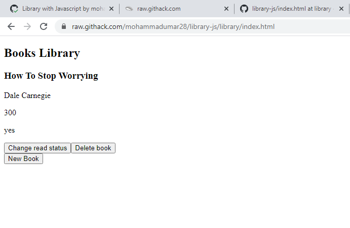

# Library Project

> A Library application where users can add and remove books, set read status.

## Built with

* Javascript
* CSS
* HTML

## Live Link

* [Live Link](https://raw.githack.com/mohammadumar28/library-js/library/index.html)

## To run the app

* Clone the project `git clone https://github.com/mohammadumar28/library-js.git`.
* Open index.html in a browser.

## Authors

**Muhammad Umar**
- Github: [@mohammadumar28](https://github.com/mohammadumar28)
- LinkedIn: [Mohammad Umar](https://www.linkedin.com/in/mohammadumar28/)
- Twitter: [@Mohammadumar28](https://twitter.com/Mohammadumar28)
- Email: [mohammadumar28@gmail.com](mailto:mohammadumar28@gmail.com)

## Acknowledgements

* [The Odin Project](https://www.theodinproject.com/courses/javascript/lessons/library)
* [Microverse](https://microverse.org)

## Contribution

* Fork this repo.
* Create your feature branch `git checkout -b my-new-feature`.
* Commit your changes `git commit -am "Add some feature"`.
* Push to the branch `git push origin my-new-feature`.
* Create a new Pull Request.
